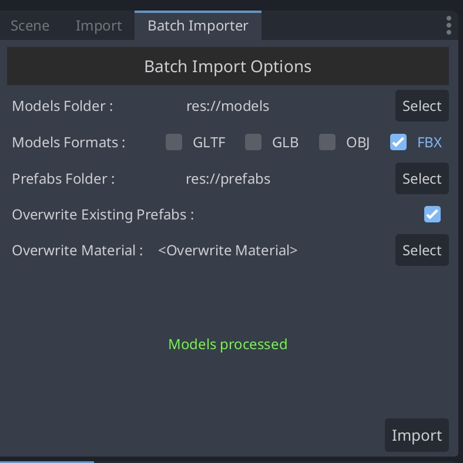

# Batch Prefab Creation
### Description
Batch Prefab Creation is a Godot plugin to help batch creations of prefabs based on 3d models.

### Motivation
Moving from Unity, the process of recreate prefabs was heavily time consuming so, at first I tryed plugins but where not updated and I didn't liked the way the prefabs were created.
What I did different here? I used the native FBX support and created inherited scenes from the models so, any change on the source file re importing it will be translated to the fcreated prefab.

### Godot Version Support
The plugin was tested on Godot 4.3 and 4.4.1

### How it works?
Once enabled the plugin you will found a new tab:
	

You must select:
- Origin folder of models
- Destination folder for prefabs (instantiated scenes)
You should select:
- Model type to be included
You can select:
- If you want or not overwrite existing files
- If you want to instantiate overwriting materials. Only one is allowed and because of limitation in Godot I can not create inherited scenes whne this option is selected.
	